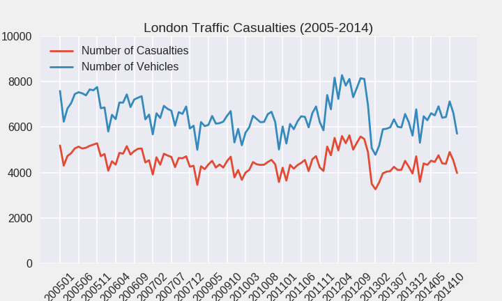
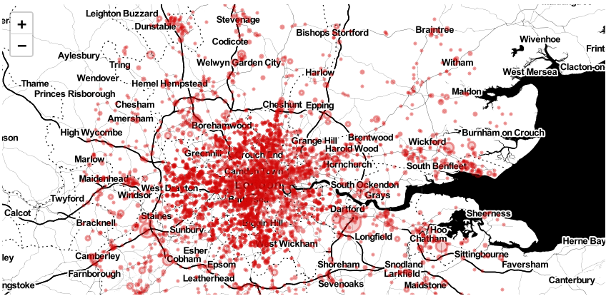

# Visualizing Vehicle and Traffic Accidents in London

This notebook analysis traffic accidents within London. The data consists of over 1.6 million data points from 2005-2014, and it is available [here](https://www.dft.gov.uk/traffic-counts/download.php). This quick analysis will answer two of the following questions:

- Did the number of accidents decrease over time?
- What is the worst month for traffic accidents? 

The license for this dataset is the Open Government Licence used by all data on [data.gov.uk](http://www.nationalarchives.gov.uk/doc/open-government-licence/version/3/) 
